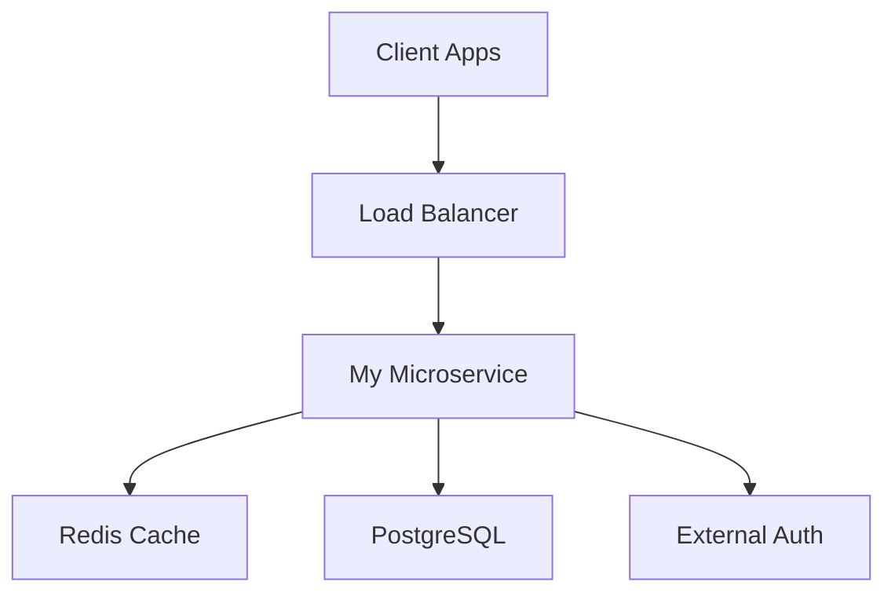

# My Microservice

[](https://github.com/platform-team/my-microservice/actions)
[](https://codecov.io/gh/platform-team/my-microservice)
[](https://hub.docker.com/r/platform-team/my-microservice)
[](https://opensource.org/licenses/MIT)

A production-ready Node.js/Express microservice for user management, designed for cloud-native deployments and seamless integration with Backstage.

## 🚀 Features

- **RESTful API** with comprehensive user management operations
- **Production Ready** with security, monitoring, and scalability built-in
- **Health Monitoring** with liveness and readiness probes
- **Docker & Kubernetes** ready with optimized configurations
- **Comprehensive Documentation** with TechDocs integration
- **Testing Suite** with unit, integration, and coverage reporting
- **Security First** with Helmet.js, CORS, and authentication integration

## 📋 Quick Start

### Prerequisites

- Node.js 18+
- Docker (optional)
- Kubernetes cluster (for deployment)

### Local Development

```bash
# Clone the repository
git clone https://github.com/platform-team/my-microservice.git
cd my-microservice

# Install dependencies
npm install

# Start development server
npm run dev

# Test the service
curl http://localhost:3000/health
```

### Using Docker

```bash
# Build and run
docker build -t my-microservice .
docker run -p 3000:3000 my-microservice

# Or use Docker Compose
docker-compose up
```

## 📊 API Overview

| Endpoint | Method | Description |
|----------|--------|-------------|
| `/` | GET | Service information |
| `/health` | GET | Health check |
| `/ready` | GET | Readiness check |
| `/api/users` | GET | Get all users |
| `/api/users` | POST | Create user |
| `/api/users/{id}` | GET | Get user by ID |
| `/api/users/{id}` | PUT | Update user |
| `/api/users/{id}` | DELETE | Delete user |

## 🚢 Deployment

### Kubernetes

```bash
# Deploy to Kubernetes
kubectl apply -f k8s/

# Verify deployment
kubectl get pods -l app=my-microservice
```

### AWS EKS

See our [Deployment Guide](docs/deployment.md) for detailed EKS deployment instructions.

## 📚 Documentation

Complete documentation is available in the `docs/` folder:

- [Getting Started](docs/getting-started.md) - Setup and first steps
- [Architecture](docs/architecture.md) - System design and components
- [API Reference](docs/api-reference.md) - Complete API documentation
- [Deployment](docs/deployment.md) - Production deployment guide
- [Development](docs/development.md) - Development workflow

## 🧪 Testing

```bash
# Run tests
npm test

# Run tests with coverage
npm run test:coverage

# Run tests in watch mode
npm run test:watch
```

## 🔧 Configuration

Environment variables:

| Variable | Description | Default |
|----------|-------------|---------|
| `NODE_ENV` | Environment mode | `development` |
| `PORT` | Server port | `3000` |
| `DATABASE_URL` | PostgreSQL connection | - |
| `REDIS_URL` | Redis connection | - |

## 🏗️ Architecture



## 🔗 Related Services

Part of the **User Management System**:

- **Redis Cache** - Session storage and caching
- **PostgreSQL Database** - User data persistence
- **External Auth Service** - Authentication and authorization

## 🤝 Contributing

1. Fork the repository
2. Create a feature branch (`git checkout -b feature/amazing-feature`)
3. Commit your changes (`git commit -m 'Add amazing feature'`)
4. Push to the branch (`git push origin feature/amazing-feature`)
5. Open a Pull Request

## 📄 License

This project is licensed under the MIT License - see the [LICENSE](LICENSE) file for details.

## 🆘 Support

- **Issues**: [GitHub Issues](https://github.com/platform-team/my-microservice/issues)
- **Documentation**: [TechDocs](https://backstage.example.com/docs/default/component/my-microservice)
- **Team**: platform-team@company.com

## 🏷️ Backstage Integration

This service is fully integrated with Backstage:

- **Service Catalog**: Registered as a component in the user-management-system
- **API Documentation**: OpenAPI specification available
- **TechDocs**: Complete documentation rendered in Backstage
- **Dependencies**: Linked to Redis cache and PostgreSQL database resources

### Backstage Links

- [Service Catalog](https://backstage.example.com/catalog/default/component/my-microservice)
- [API Documentation](https://backstage.example.com/api-docs/default/api/my-microservice-api)
- [TechDocs](https://backstage.example.com/docs/default/component/my-microservice)

---

**Built with ❤️ by the Platform Team**