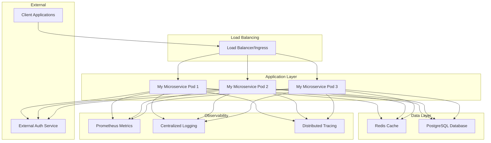
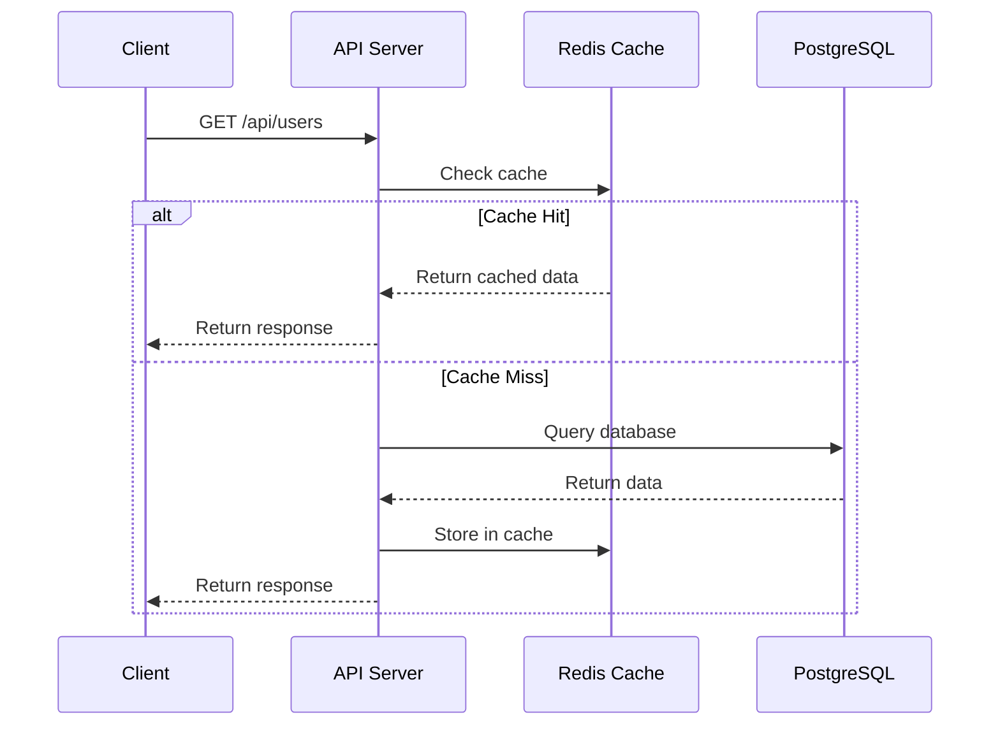
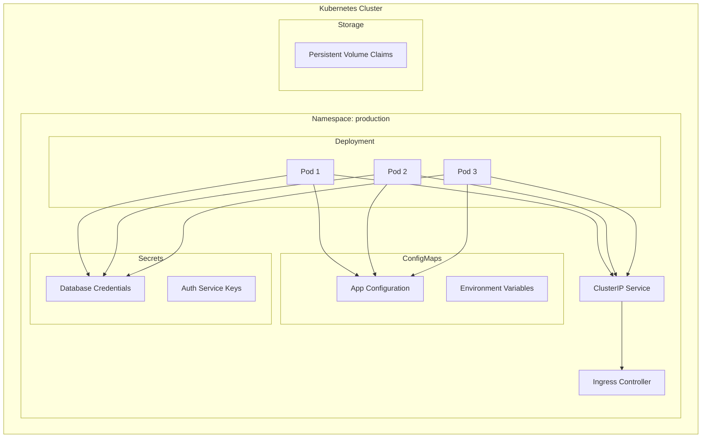
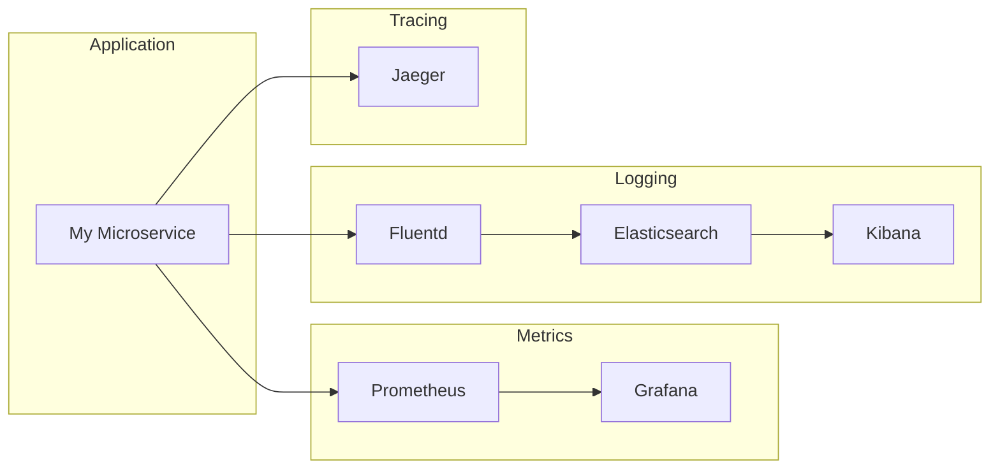
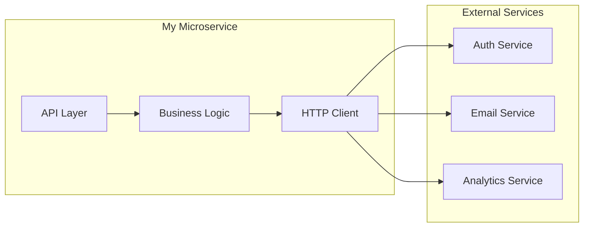

# Architecture

This document describes the architecture and design principles of My Microservice.

## System Overview

My Microservice is designed as a cloud-native, containerized application following microservices architecture patterns. It provides user management capabilities with high availability, scalability, and observability.



## Core Components

### Application Server

- **Framework**: Express.js
- **Runtime**: Node.js 18+
- **Language**: JavaScript
- **Architecture**: RESTful API

### Key Features

- **Health Checks**: Liveness and readiness probes
- **Security**: Helmet.js, CORS, input validation
- **Logging**: Structured logging with Morgan
- **Error Handling**: Centralized error handling
- **Graceful Shutdown**: Proper cleanup on termination

## Data Architecture

### Primary Database

- **Type**: PostgreSQL 15+
- **Purpose**: User data persistence
- **Features**: ACID compliance, JSON support, full-text search

### Caching Layer

- **Type**: Redis 7+
- **Purpose**: Session storage, API response caching
- **Features**: High performance, pub/sub, persistence

### Data Flow



## Security Architecture

### Authentication & Authorization

- **External Auth Service**: JWT token validation
- **Bearer Token**: API authentication
- **Role-Based Access**: User permissions

### Security Measures

- **Helmet.js**: Security headers
- **CORS**: Cross-origin resource sharing
- **Input Validation**: Request sanitization
- **Rate Limiting**: API throttling
- **TLS/SSL**: Encrypted communication

## Deployment Architecture

### Kubernetes Deployment



### Container Architecture

```dockerfile
# Multi-stage build
FROM node:18-alpine AS builder
# Build application

FROM node:18-alpine AS runtime
# Production runtime
USER nodejs
EXPOSE 3000
HEALTHCHECK --interval=30s CMD curl -f http://localhost:3000/health
```

## Scalability Design

### Horizontal Scaling

- **Stateless Design**: No server-side sessions
- **Load Balancing**: Round-robin distribution
- **Auto-scaling**: HPA based on CPU/memory
- **Database Connection Pooling**: Efficient resource usage

### Performance Optimization

- **Caching Strategy**: Redis for frequently accessed data
- **Database Indexing**: Optimized query performance
- **Connection Pooling**: Reuse database connections
- **Compression**: Gzip response compression

## Observability

### Monitoring Stack



### Health Checks

- **Liveness Probe**: `/health` endpoint
- **Readiness Probe**: `/ready` endpoint
- **Startup Probe**: Initial health verification

### Metrics Collection

- **Application Metrics**: Request count, response time, error rate
- **System Metrics**: CPU, memory, disk usage
- **Business Metrics**: User operations, API usage

## Integration Patterns

### External Service Integration



### Error Handling

- **Circuit Breaker**: Prevent cascade failures
- **Retry Logic**: Exponential backoff
- **Timeout Handling**: Request timeouts
- **Fallback Mechanisms**: Graceful degradation

## Development Principles

### Design Patterns

- **Repository Pattern**: Data access abstraction
- **Dependency Injection**: Loose coupling
- **Factory Pattern**: Object creation
- **Observer Pattern**: Event handling

### Code Organization

```
src/
├── controllers/     # Request handlers
├── services/        # Business logic
├── repositories/    # Data access
├── middleware/      # Express middleware
├── models/          # Data models
├── utils/           # Utility functions
└── config/          # Configuration
```

### Testing Strategy

- **Unit Tests**: Individual component testing
- **Integration Tests**: API endpoint testing
- **Contract Tests**: External service mocking
- **Load Tests**: Performance validation

## Disaster Recovery

### Backup Strategy

- **Database Backups**: Daily automated backups
- **Configuration Backups**: GitOps repository
- **Disaster Recovery**: Multi-region deployment

### High Availability

- **Multi-AZ Deployment**: Availability zone distribution
- **Health Monitoring**: Automatic failover
- **Data Replication**: Database clustering
- **Load Distribution**: Geographic load balancing

## Future Considerations

### Planned Enhancements

- **GraphQL API**: Alternative query interface
- **Event Sourcing**: Audit trail implementation
- **CQRS Pattern**: Command-query separation
- **Microservice Mesh**: Service mesh integration

### Technology Roadmap

- **Kubernetes Operators**: Custom resource management
- **Serverless Functions**: Event-driven processing
- **Machine Learning**: Intelligent user insights
- **Blockchain Integration**: Decentralized identity