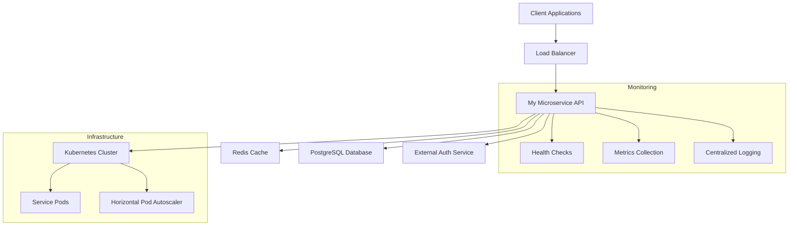

# My Microservice

Welcome to **My Microservice** - a production-ready Node.js/Express microservice designed for modern cloud-native deployments and seamless integration with Backstage.

## 🎯 Overview

My Microservice is a comprehensive user management API that provides essential functionality for modern applications. Built with industry best practices, it offers robust user operations, health monitoring, and seamless integration capabilities.

### Key Features

- **🚀 RESTful API** - Complete CRUD operations for user management
- **💪 Production Ready** - Built with security, monitoring, and scalability in mind
- **🔒 Security First** - Helmet.js, CORS, and authentication integration
- **📊 Health Monitoring** - Comprehensive health and readiness checks
- **🐳 Container Ready** - Docker and Kubernetes deployment configurations
- **📚 Documentation** - Complete API documentation and TechDocs integration
- **🧪 Testing** - Comprehensive test suite with coverage reporting
- **🔄 CI/CD Ready** - GitHub Actions workflows and deployment automation

## 🏗️ Architecture



## 🚀 Quick Start

### Prerequisites

- Node.js 18+
- Docker (optional)
- Kubernetes cluster (for deployment)

### Local Development

1. **Clone the repository:**
   ```bash
   git clone https://github.com/platform-team/my-microservice.git
   cd my-microservice
   ```

2. **Install dependencies:**
   ```bash
   npm install
   ```

3. **Start development server:**
   ```bash
   npm run dev
   ```

4. **Test the service:**
   ```bash
   curl http://localhost:3000/health
   ```

### Using Docker

```bash
# Build and run with Docker
docker build -t my-microservice .
docker run -p 3000:3000 my-microservice
```

## 📊 API Endpoints

| Method | Endpoint | Description |
|--------|----------|-------------|
| GET | `/` | Service information |
| GET | `/health` | Health check (liveness probe) |
| GET | `/ready` | Readiness check (readiness probe) |
| GET | `/api/users` | Get all users (paginated) |
| POST | `/api/users` | Create a new user |
| GET | `/api/users/{id}` | Get user by ID |
| PUT | `/api/users/{id}` | Update user |
| DELETE | `/api/users/{id}` | Delete user |

### Example API Calls

```bash
# Get service information
curl https://my-microservice.example.com/

# Get all users
curl https://my-microservice.example.com/api/users

# Get specific user
curl https://my-microservice.example.com/api/users/1

# Create new user
curl -X POST https://my-microservice.example.com/api/users \
  -H "Content-Type: application/json" \
  -d '{"name": "John Doe", "email": "john@example.com"}'
```

## 🔧 Configuration

### Environment Variables

| Variable | Description | Default | Required |
|----------|-------------|---------|----------|
| `NODE_ENV` | Environment mode | `development` | No |
| `PORT` | Server port | `3000` | No |
| `LOG_LEVEL` | Logging level | `info` | No |
| `REDIS_URL` | Redis connection URL | - | Yes (production) |
| `DATABASE_URL` | PostgreSQL connection URL | - | Yes (production) |
| `AUTH_SERVICE_URL` | External auth service URL | - | Yes (production) |

## 🚢 Deployment

### Kubernetes

```bash
# Deploy to Kubernetes
kubectl apply -f k8s/

# Verify deployment
kubectl get pods -l app=my-microservice
kubectl get svc my-microservice-service
```

### AWS EKS

For detailed EKS deployment instructions, see [Deployment Guide](deployment.md).

## 📚 Documentation

- [Getting Started](getting-started.md) - Setup and first steps
- [Architecture](architecture.md) - System design and components
- [API Reference](api-reference.md) - Complete API documentation
- [Deployment](deployment.md) - Production deployment guide
- [Development](development.md) - Development workflow and guidelines
- [Monitoring](monitoring.md) - Observability and monitoring setup
- [Troubleshooting](troubleshooting.md) - Common issues and solutions

## 🔗 Related Services

This microservice is part of the **User Management System** and integrates with:

- **Redis Cache** - Session storage and caching
- **PostgreSQL Database** - User data persistence
- **External Auth Service** - Authentication and authorization
- **Monitoring Stack** - Prometheus, Grafana, and alerting

## 🤝 Contributing

1. Fork the repository
2. Create a feature branch
3. Make your changes
4. Add tests for new functionality
5. Ensure all tests pass
6. Submit a pull request

## 📄 License

This project is licensed under the MIT License - see the [LICENSE](LICENSE) file for details.

## 🆘 Support

For support and questions:

- **GitHub Issues** - [Create an issue](https://github.com/platform-team/my-microservice/issues)
- **Documentation** - Check the [docs](https://my-microservice.example.com/docs)
- **Team Contact** - platform-team@company.com

---

**Built with ❤️ by the Platform Team for seamless Backstage integration**